- 📄 **First-author, IEEE ICAIC 2026** — [Hybrid Federated Learning for IoT Intrusion Detection](https://ieeexplore.ieee.org/document/11395795): 97.98% accuracy on 2.4M samples, LoRA adapters cutting communication payload 89.5%
- 💼 **Data Science Co-op @ Labelmaster** — recovered **$40M+ in mis-attributed sales** by fixing a merge defect behind 4,792 false $0 records; mapped 26,290 sites across 178 corporate families for white-space analysis
- 🥈 **2nd place, Oracle Datathon 2026** (AI & Analytics Summit) · **Patent holder** — [SATURDAE](https://github.com/madhusiddharths/SATURDAE) voice-driven floor-plan designer (Indian Patent No. 202341038832 A)

## ⚡ Featured work

| Project | What it does | Try it |
|---|---|---|
| [PulseTrade](https://github.com/madhusiddharths/pulsetrade) | Real-time financial intelligence: Kafka → Delta Lake medallion → Spark streaming, with an **agentic AI investigator** that explains market anomalies in plain language | — |
| [Galaxy Explorer](https://github.com/madhusiddharths/galaxy_explorer) | **557M+ Gaia DR3 stars** engineered from 750+ GB on one machine, rendered in 3D at 60 FPS from clustered BigQuery |  |
| [Growth & Retention](https://github.com/madhusiddharths/growth_retention) | 20M+ e-commerce events → validated A/B test (**6.73% → 10.83% conversion, p < 0.001**) + cart-abandonment XGBoost with SHAP explanations (0.80 ROC-AUC) |  |
| [Online Retail](https://github.com/madhusiddharths/Online_retail) | ~540K transactions → tested star schema → **RFM segments & cohort retention** (£10.23M revenue analyzed) |  |
| [Alzheimer's Progression](https://github.com/madhusiddharths/alzheimers_progression) | EfficientNetB4 classifier hitting **98% accuracy** across four disease stages + chained GANs synthesizing future-stage MRIs |  |
| [AI-Counselling](https://github.com/madhusiddharths/aicounselling) | Multimodal mental-health companion fusing **seven signals** (voice, face, DSM-5 RAG, memory) into one Gemini pipeline | — |
| [Crypto Tweet Impact](https://github.com/madhusiddharths/crypto_tweet_impact) | Do Musk's tweets move crypto? **~20K LLM-classified tweets**, rigorous R event study with FDR-corrected statistics | — |
| [Health Hotspot](https://github.com/madhusiddharths/hotspot) | Flu surveillance across **56 Chicago ZIP codes** + a privacy-preserving personal exposure model from Google Timeline data |  |

## 🛠️ Skills

  
  
  
  
  
  
  
  
  
  
  
  
  
  
  
  
  
  
  
  

## 📜 Certifications

  
  
  
  

## 📊 GitHub stats

  

  

  
  
  

  More: <a href="https://github.com/madhusiddharths/Traffic-Prediction">Traffic-Prediction</a> · <a href="https://github.com/madhusiddharths/image_retrieval">Image Retrieval</a>

