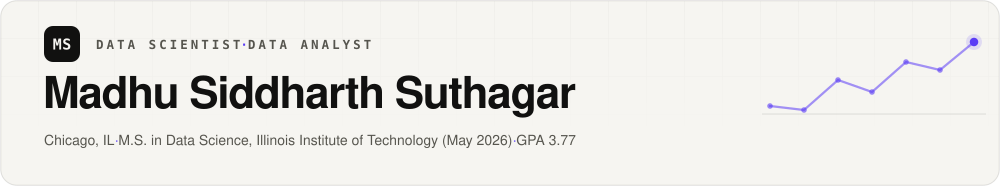

<picture>
  <source media="(prefers-color-scheme: dark)" srcset="assets/header-dark.svg">
  
</picture>

I build end-to-end data systems — pipelines, analytics, and machine learning that turn large, messy datasets into decisions.

  
  
  

## Highlights

- **First-author, IEEE ICAIC 2026** — [Hybrid Federated Learning for IoT Intrusion Detection](https://ieeexplore.ieee.org/document/11395795): 97.98% accuracy on 2.4M samples, with LoRA adapters cutting communication payload by 89.5%.
- **Data Science Co-op, Labelmaster** — recovered **$40M+ in mis-attributed sales** by fixing the merge defect behind 4,792 false $0 records; mapped 26,290 sites across 178 corporate families for white-space analysis.
- **2nd place, Oracle Datathon 2026** (AI & Analytics Summit) and **patent holder** — [SATURDAE](https://github.com/madhusiddharths/SATURDAE), a voice-driven floor-plan designer (Indian Patent No. 202341038832 A).

<picture>
  <source media="(prefers-color-scheme: dark)" srcset="assets/divider-dark.svg">
  
</picture>

## Selected projects

| Project | What it does | Demo |
|---|---|---|
| [PulseTrade](https://github.com/madhusiddharths/pulsetrade) | Real-time financial intelligence: Kafka → Delta Lake medallion → Spark streaming, with an agentic AI investigator that explains market anomalies in plain language | — |
| [Galaxy Explorer](https://github.com/madhusiddharths/galaxy_explorer) | **557M+ Gaia DR3 stars** engineered from 750+ GB on one machine, rendered in 3D at 60 FPS from clustered BigQuery |  |
| [Growth & Retention](https://github.com/madhusiddharths/growth_retention) | 20M+ e-commerce events → validated A/B test (**6.73% → 10.83% conversion, p < 0.001**), plus a cart-abandonment XGBoost model with SHAP explanations (0.80 ROC-AUC) |  |
| [Online Retail](https://github.com/madhusiddharths/Online_retail) | ~540K transactions → tested star schema → **RFM segments and cohort retention** across £10.23M in revenue |  |
| [Alzheimer's Progression](https://github.com/madhusiddharths/alzheimers_progression) | EfficientNetB4 classifier at **98% accuracy** across four disease stages, plus chained GANs synthesizing future-stage MRIs |  |
| [AI-Counselling](https://github.com/madhusiddharths/aicounselling) | Multimodal mental-health companion fusing seven signals (voice, face, DSM-5 RAG, memory) into one Gemini pipeline | — |
| [Crypto Tweet Impact](https://github.com/madhusiddharths/crypto_tweet_impact) | Do Musk's tweets move crypto? ~20K LLM-classified tweets in a rigorous R event study with FDR-corrected statistics | — |
| [Health Hotspot](https://github.com/madhusiddharths/hotspot) | Flu surveillance across 56 Chicago ZIP codes, plus a privacy-preserving personal exposure model built from Google Timeline data |  |

Also on GitHub: [Traffic-Prediction](https://github.com/madhusiddharths/Traffic-Prediction) · [Image Retrieval](https://github.com/madhusiddharths/image_retrieval)

<picture>
  <source media="(prefers-color-scheme: dark)" srcset="assets/divider-dark.svg">
  
</picture>

## Skills

| | |
|---|---|
| **Languages** |    |
| **Data engineering** |        |
| **Machine learning** |    |
| **Analytics & BI** |    |
| **Cloud & infrastructure** |     |

## Certifications

  
  
  
  

<picture>
  <source media="(prefers-color-scheme: dark)" srcset="assets/divider-dark.svg">
  
</picture>

Open to data scientist and data analyst roles — reach me at [madhusiddharths1@outlook.com](mailto:madhusiddharths1@outlook.com) or on [LinkedIn](https://www.linkedin.com/in/madhu-siddharth-suthagar/).
